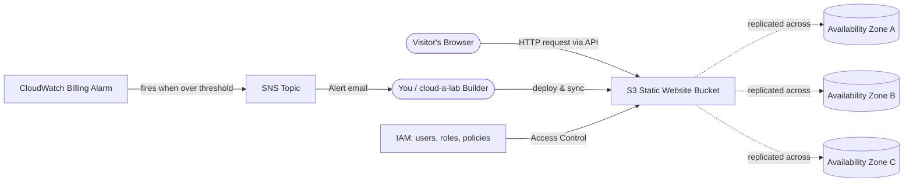

### 🏗️ Active Learning Challenge

Wearing Two Hats
----------------

Remember, as a solo learner you _are_ both, but keep the distinction clear because it’s exactly how real teams work:

*   🧑‍✈️ **The Admin:** your root/admin login. Creates identities and grants permissions.
*   👷 **The Builder:** your CloudGlossary IAM user that starts with **zero permissions**. This is **you** doing the lab.

A | Prerequisites
-----------------

Before we touch any cloud concept, let’s get your workbench ready.

### Step 01: **AWS Account**

🔗[**Amazon Web Services**](https://medium.com/amazon-web-services-a8e57a9c6084)

> _🧠_ **_Reflect:_** You just signed up for access to data centres on multiple continents in about 5 minutes. That speed is called [**_Agility_**](https://medium.com/agility-edee2e26b17f)**_._**

### Step 02: Install the AWS CLI

The CLI (Command Line Interface) lets you control AWS by typing commands instead of clicking around.

*   **Windows:** download and run the installer from [https://awscli.amazonaws.com/AWSCLIV2.msi](https://awscli.amazonaws.com/AWSCLIV2.msi)
*   **macOS:** `brew install awscli`
*   **Linux:** `sudo apt-get install awscli`

**💡Verify it**

```
aws --version
```

**You should see something like:** `aws-cli/2.x.x`.

### Step 03: Create An Access Key And Configure The CLI

> _⚠️_ **_These are powerful admin credentials._**
> 
> _We will replace this with a safer IAM user in Step 2. For now, use it just to confirm things work._

**Step 03.1:** In the AWS Console, click **your account name ▼**

**Step 03.2:** Select **Security credentials**

**Step 03.3:** Under **Access keys**, create one.

**Step 03.4** Copy the **Access key ID** and **Secret access key**.

> _⚠️_ **_Download the .csv file._** _We will be using this key throughout the gallery._

**Step 03.5: In your terminal**

```
aws configure
```

**Step 03.6:**

*   **AWS Access Key ID:** `Paste _your_ Access Key ID`
*   **AWS Secret Access Key:** `Paste _your_ Secret Access Key`
*   **Default region name:** `us-east-1`
*   **Default output format:** `json`

**Step 03.7:** Test that you’re connected

```
aws sts get-caller-identity
```

**💡 If it prints an account number and ARN, you’re in. 🎉**

### Step 04: Install Git

🔗[**Git in the Cloud**](https://medium.com/git-in-the-cloud-d8fed43331fc)

You’ll push your work to git at the end. If it’s missing, get it.

```
git --version
```

> **_⚠️ You’ll create the project folder (`A/`) and every file inside it with your own hands, then push the finished result to your own GitHub at the end._**

### Checklist Before Moving On

✔ AWS Account

✔ `aws --version` works

✔ `aws sts get-caller-identity` returns your account

✔ `git --version` works

B | Abstraction, Attributes And Agility
---------------------------------------

### Step 01: Abstraction

> **_💡_**_Abstraction means hiding complicated details so you can focus on the result. You drive a car without understanding the engine. In the cloud, you launch a server without buying, racking, cooling, or wiring a physical machine._

List the storage service we’ll use later.

> **_💡You’re about to use a global storage system spanning many data centres with one short command — that’s abstraction at work._**

**❓** **Which hat am I wearing?** _You’re still using the_ 🧑‍✈️_Admin/Root credentials._

```
aws s3 ls
```

If you have no buckets yet, this returns nothing. That’s fine. The point is you didn’t have to think about hard drives, file systems, or replication. AWS abstracts all of it away.

> _🧠_ **_Reflect:_** What physical work did AWS just hide from you? (Hint: power, cooling, networking, disk failure, backups…)

### Step 02: Agility

> **_💡A_**_gility is the ability to move fast. Experiment, scale, and change direction quickly because resources are available on demand._

Time yourself creating and deleting a storage bucket. In the old world this would be a purchase order and weeks of waiting.

```
aws s3 mb s3://agility-test-1234
aws s3 rb s3://agility-test-1234
```

> **_💡You just provisioned and de-provisioned infrastructure in seconds._**

That is Agility.

But…agility cuts both ways. If anyone can spin up resources in seconds, anyone with leaked keys could too. That’s exactly why we need tight access control.

> _🧠 Reflect:_ How long would it take to get a physical server delivered and installed? Compare that to the seconds above.

### Step 03: Attributes

> **_💡_**_Every cloud resource has attributes: its settings and properties. A storage bucket has a name, a region, and access settings. A server has CPU, memory, and a pricing tier._

Look at the attributes of your account’s region setting.

```
aws configure list
```

> **_💡_**_Notice the_ `_region_` _attribute. That single attribute decides which physical part of the world your resources live in._

We’ll set more attributes (like CPU and memory tiers).

> **_🧠 Reflect:_** Why might the `region` attribute matter for speed and for legal/data rules?

### Checklist Before Moving On

✔ Ran `aws s3 ls`

✔ Created and deleted a bucket (felt the agility)

✔ Inspected your region attribute

C | **Access Control, Authentication & Authorisation**
------------------------------------------------------

Security comes **before** building, not _after._ And in this lab we start where every safe cloud identity _should_ start: with **zero permissions**.

> _💡_**_The Golden Rule of AWS:_** _every identity can do nothing by default. This is called an implicit deny. Nothing is allowed until someone explicitly grants it. We’ll feel this rule, not just read it._

These three terms are easy to confuse, so let’s nail them:

```
**Term**            | _Question It Answers  _   | Example
----------------|-------------------------|------------------------------------------
**Authentication**  | _Who are you?_            | Logging in with a password + MFA code
**Authorisation **  | _What are you allowed?_   | "This user may read S3 but not delete it"
**Access Control**  | _The whole system above_  | IAM users, roles, and policies together
```

The AWS service that handles all of this is **IAM** (Identity and Access Management).

### Step 01: Authentication

> _💡Authentication verifies you are who you claim to be. A password is one factor._
> 
> **_MFA_** _(Multi-Factor Authentication) adds a second factor (a code from your phone), so a stolen password alone isn’t enough._

🔗 [**Authentication**](https://medium.com/authentication-fb0d207899a1)

> _🧠_ **_Reflect:_** Why is protecting the **root** account the single most important security step in a new AWS account?

### Step 02: Authorisation

**Step 02.1: Wear** 🧑‍✈️**The Admin Hat and run:**

```
aws configure --profile the-builder
```

*   **AWS Access Key ID:** `Paste _your_ Access Key ID`
*   **AWS Secret Access Key:** `Paste _your_ Secret Access Key`
*   **Default region name:** `us-east-1`
*   **Default output format:** `json`

**Step 02.2: Authentication test**

Wear 👷The Builder Hat and run:

```
oaws sts get-caller-identity --profile builder
```

✅ This **works.** It returns The Builder’s ARN. AWS knows who you are. That’s **authentication**.

**Step 02.3:** 👷 **Authorisation test**

```
aws s3 ls --profile the-builder
```

❌ This **fails** with `AccessDenied`. AWS knows who you are, but you're allowed to do nothing. That's **authorisation** (or rather, the lack of it).

> _🧠_ **_Reflect:_** You were authenticated but not authorised. In your own words, why is “**who you are**” a completely separate question from “**what you may do”**?

You just experienced the **implicit deny**. Nobody blocked you on purpose, The absence of a permission _is_ the block.

### Step 03: Least Privilege

> _💡_**_Least Privilege:_** _the opposite of handing out_ `_AdministratorAccess_`_._

We’re building from pure scratch, so you’ll create the policy file yourself, then hand it to AWS. This same folder becomes the repo you push to GitHub at the end

**Step 03.1: Create the Project Folders**

> _💡Run these from wherever you keep your projects (e.g. your_ `_Documents_` _or a_ `_dev_` _folder)_.

**Windows (Command Prompt or PowerShell):**

```
 mkdir A
  cd A
  mkdir infrastructure\iam
  cd infrastructure\iam
```

**macOS / Linux / Git Bash:**

```
  mkdir -p A/infrastructure/iam
  cd A/infrastructure/iam
```

**Step 03.2: Create the Policy file**

**Windows (Command Prompt):**

```
 type nul > website-developer-policy.json
  notepad website-developer-policy.json
```

**macOS / Linux / Git Bash:**

```
touch website-developer-policy.json
nano website-developer-policy.json
```

> _💡Or skip the terminal entirely and create the file in your code editor (in VS Code: right-click the_ `_iam_` _folder →_ **_New File_** _→ name it_ `_website-developer-policy.json_`_)._

**Step 03.3:** Paste this into `website-developer-policy.json`

```
 {
    "Version": "2012-10-17",
    "Statement": [      {
        "Sid": "ListBucketsToSeeWhatExists",
        "Effect": "Allow",
        "Action": [          "s3:ListAllMyBuckets",
          "s3:GetBucketLocation"
        ],
        "Resource": "*"
      },
      {
        "Sid": "ManageOnlyTheLabWebsiteBuckets",
        "Effect": "Allow",
        "Action": [          "s3:CreateBucket",
          "s3:DeleteBucket",
          "s3:PutBucketWebsite",
          "s3:PutBucketPolicy",
          "s3:PutBucketPublicAccessBlock",
          "s3:ListBucket",
          "s3:GetObject",
          "s3:PutObject",
          "s3:DeleteObject"
        ],
        "Resource": [          "arn:aws:s3:::cloudglossary-a-*",
          "arn:aws:s3:::cloudglossary-a-*/*"
        ]
      }
    ]
  }
```

**Step 03.4:** Save the file. Analyze it:

*   lists _specific_ S3 actions (not `"*"` = everything), and
*   is scoped to buckets named `cloudglossary-a-*` (not every bucket you own).

Granting `"Action": "*"` on `"Resource": "*"` would be the lazy shortcut and a classic **Anti-Pattern.**

**Step 03.5:** Create the policy in AWS and attach it to The Builder.

> **_⚠️_**_Run this from the_ **_repo root_** _(the_ `_A/_` _folder) so the_ `_file://_` _path matches._
> 
> _If you're still inside_ `_iam/_`_, go back up first:_ `_cd ...._` _(Windows) or_ `_cd ../.._` _(macOS/Linux)._

```
 # Create a tightly-scoped policy from the file you just wrote
  aws iam create-policy \
    --policy-name CloudALabS3Policy \
    --policy-document file://infrastructure/iam/website-developer-policy.json
  # Attach it to the Builder (replace ACCOUNT_ID with your 12-digit account number)
  aws iam attach-user-policy \
    --user-name CloudGlossary \
    --policy-arn arn:aws:iam::ACCOUNT_ID:policy/CloudALabS3Policy
```

**Step 03.6:** **(**👷 **The-Builder Hat)** The wall moves, but only where you opened it.

✅ **This now SUCCEEDS as you granted** `**s3:ListAllMyBuckets:**`

```
aws s3 ls --profile the-builder
```

❌ **This still FAILS because you never granted EC2 permissions**

```
  aws ec2 describe-instances --profile the-builder
```

**The Builder** 👷 can now do exactly what the lab needs and nothing else. That gap between “works” and “still denied” _is_ least privilege you can see.

> _🧠_ **_Reflect:_** Compare this to being handed admin keys on day one. What’s the risk of starting with everything and trying to remove permissions later, versus starting at zero and adding them?

### Step 04: Access Control

> _💡_**_Roles vs Users:_** _A_ **_user_** _is a long-lived identity (a person)._
> 
> _A_ **_role_** _is a temporary identity that services or people can assume when needed._
> 
> _Roles are safer because the credentials are short-lived and they start at zero permissions too, until a policy is attached._

**Example read-only role trust policy**

```
{
  "Version": "2012-10-17",
  "Statement": [    {
      "Sid": "WhoIsAllowedToAssumeThisRole",
      "Effect": "Allow",
      "Principal": {
        "AWS": "arn:aws:iam::ACCOUNT_ID:user/CloudGlossary"
      },
      "Action": "sts:AssumeRole"
    }
  ]
}
```

> _🧠_ **_Reflect:_** A teammate needs to view your site’s files for one afternoon. Would you give them a permanent user or a temporary role? Why?

### Step 05: Use The Builder For The Rest Of The Lab

From here on, run commands as The Builder so you’re always operating at least privilege. Either add `--profile the-builder` to each command, or set it as the default:

```
  # macOS/Linux
  export AWS_PROFILE=the-builder
  # Windows (PowerShell)
  $env:AWS_PROFILE="the-builder"
```

> **_⚠️_** _If a later step fails with_ `_AccessDenied_`_, that's not a bug._
> 
> _It's the implicit deny telling you the Builder needs one more specific permission._
> 
> _Add it deliberately (Admin hat), then continue. That loop is the lesson._

### Checklist Before Moving On

✔ **MFA** enabled on the root account

✔`CloudGlossary`Builder created with **zero** permissions

✔ Saw `get-caller-identity` succeed but `s3 ls` fail (authn vs authz)

✔ Granted the scoped least-privilege policy

✔ Confirmed `s3 ls` now works while `ec2` is still denied

✔ Switched the CLI to the The Builder profile

D | Availability, Availability Zones & Anti-Patterns
----------------------------------------------------

**Build something real:** a static website served from Amazon S3.

### Step 01: Availability

> _💡_ _Availability means your system is up and reachable when people need it. It’s often measured in “nines” (99.9%, 99.99%…). S3 is designed for extremely high availability because AWS stores copies of your files in multiple places._

🔗 [**Availability**](https://medium.com/availability-300d472ddece)

### Step 02: Availability Zones

> _💡A_ **_Region_** _(like_ `_us-east-1_`_) is a geographic area. I_
> 
> _Inside each region are multiple_ **_Availability Zones (AZs):_** _Physically separate data centres with their own power and networking. If one building has a problem, the others keep serving. S3 automatically spreads your data across AZs, so you get this resilience for free._

🔗 [**Availability Zones**](https://medium.com/availability-zones-8364186c666e)

**See the AZs in your region:**

```
aws ec2 describe-availability-zones --query "AvailabilityZones[].ZoneName" --output table
```

**Output**

```
---------------------------
|DescribeAvailabilityZones|
+-------------------------+
|  us-east-1a             |
|  us-east-1b             |
|  us-east-1c             |
|  us-east-1d             |
|  us-east-1e             |
|  us-east-1f             |
+-------------------------+
```

> _🧠_ **_Reflect:_** Why is storing all your data in a single building a risky idea? How do multiple AZs solve it?

### Step 03: Website Files

**Step 03.1:** You’re still building your own repo. From Step 2 you have an `A/` folder with `infrastructure/iam/` inside it. Now add a `website/` folder with three files.

```
mkdir website
```

**Step 03.2:** Create `website/index.html` and paste this

```
<html lang="en">
<head>
    <meta charset="UTF-8" />
    <meta name="viewport" content="width=device-width, initial-scale=1.0" />
    <title>A</title>
    <link rel="stylesheet" href="styles.css" />
</head>
<body>
    <main class="card">
        <div class="badge">☁️ Hosted on Amazon S3</div>
        <h1>Summarisation of the As</h1>
        <p>
            This page is being served from an S3 bucket you created from scratch.
            No physical server. No wires. Just <strong>abstraction</strong>,
            a few <strong>API</strong> calls, and a little <strong>agility</strong>.
        </p>
        <h2>What's happening behind this page</h2>
        <ul class="concepts">
            <li><strong>Abstraction:</strong> AWS hides the hardware; you see a URL.</li>
            <li><strong>Availability Zones:</strong> your files are copied across data centres.</li>
            <li><strong>Access Control:</strong> IAM decides who can change this site.</li>
            <li><strong>Alarms &amp; Alerts:</strong> a billing alarm is watching your costs.</li>
            <li><strong>Automation:</strong> this was deployed with a script / CloudFormation.</li>
        </ul>
        <p class="footer">
            Active Learning Challenge · Build → Break (safely) → Fix → Learn → Repeat
        </p>
    </main>
</body>
</html>
```

**Step 03.3:** Create `website/styles.css` and paste this

```
:root {
    --bg: #000000;
    --accent: #ff9900; /* AWS orange */
    --card: #ffffff;
    --text: #1a2b42;
    --muted: #5c6b80;
}
* { box-sizing: border-box; margin: 0; padding: 0; }
body {
    font-family: -apple-system, BlinkMacSystemFont, "Segoe UI", Roboto, Helvetica, Arial, sans-serif;
    background: var(--bg);
    color: var(--text);
    min-height: 100vh;
    display: flex;
    align-items: center;
    justify-content: center;
    padding: 1.5rem;
}
.card {
    background: var(--card);
    max-width: 640px;
    width: 100%;
    padding: 2.5rem;
    border-radius: 16px;
    box-shadow: 0 20px 60px rgba(0, 0, 0, 0.35);
}
.badge {
    display: inline-block;
    background: var(--accent);
    color: #1a2b42;
    font-weight: 600;
    font-size: 0.85rem;
    padding: 0.35rem 0.75rem;
    border-radius: 999px;
    margin-bottom: 1.25rem;
}
h1 { font-size: 1.9rem; margin-bottom: 0.75rem; }
h2 { font-size: 1.15rem; margin: 1.75rem 0 0.75rem; color: var(--accent); }
p { color: var(--muted); line-height: 1.6; }
.concepts { list-style: none; }
.concepts li {
    padding: 0.55rem 0 0.55rem 1.5rem;
    position: relative;
    color: var(--text);
    border-bottom: 1px solid #eef1f5;
}
.concepts li::before {
    content: "✓";
    position: absolute;
    left: 0;
    color: var(--accent);
    font-weight: 700;
}
.footer {
    margin-top: 2rem;
    font-size: 0.85rem;
    text-align: center;
    color: var(--muted);
```

**Step 03.4:** Create `website/error.html` and paste this

```
<!DOCTYPE html>
<html lang="en">
<head>
    <meta charset="UTF-8" />
    <meta name="viewport" content="width=device-width, initial-scale=1.0" />
    <title>A — Page Not Found</title>
    <link rel="stylesheet" href="styles.css" />
</head>
<body>
    <main class="card">
        <div class="badge">404 Error</div>
        <h1>Hmm, that page isn't here.</h1>
        <p>
            You're seeing the <strong>error document</strong> you configured on your
            S3 bucket. That's a resource <strong>attribute</strong> doing its job:
            when a page is missing, S3 serves this file instead.
        </p>
        <p class="footer"><a href="index.html" style="color:var(--accent)">← Back to the home page</a></p>
    </main>
</body>
</html>
```

> _💡_ **_Preview locally before you spend a cent._**
> 
> _From inside_ `_website/_`_, run_ `_python -m http.server 8000_` _and open_ [_http://localhost:8000_](http://localhost:8000/)_._
> 
> _This serves the exact files S3 will serve. No AWS needed… yet._

**Step 03.5:** CCreate `infrastructure/iam/public-read-bucket-policy.json` and paste this

```
{
  "Version": "2012-10-17",
  "Statement": [    {
      "Sid": "AllowPublicReadForWebsite",
      "Effect": "Allow",
      "Principal": "*",
      "Action": "s3:GetObject",
      "Resource": "arn:aws:s3:::BUCKET_NAME/*"
    }
  ]
}
```

This is the **Access Control** rule that lets the public _read_ (and only read) your website files.

### Step 04: Build

Run these from the repo root (`A/`). Pick a **globally unique** bucket name starting with `cloudglossary-a-` (add random numbers or your AWS Account ID number).

**Step 04.1: Create the bucket**

```
aws s3 mb s3://cloudglossary-a-1234

```

**Step 04.2: Turn on static website hosting (index + error pages are attributes!)**

```
# 
aws s3 website s3://cloudglossary-a-1234 \
  --index-document index.html \
  --error-document error.html

```

**Step 04.3: Allow public read access**

```
# See the note on Anti-Patterns below)
aws s3api put-public-access-block --bucket cloudglossary-a-1234 \
  --public-access-block-configuration "BlockPublicAcls=false,IgnorePublicAcls=false,BlockPublicPolicy=false,RestrictPublicBuckets=false"
aws s3api put-bucket-policy --bucket cloudglossary-a-1234 \
  --policy file://infrastructure/iam/public-read-bucket-policy.json
# NOTE: edit that file first and replace BUCKET_NAME with your bucket name

```

**Step 04.4: Upload the website**

```

aws s3 sync website s3://cloudglossary-a-123
```

**Step 04.5: Your site is now live**

```
http://cloudglossary-a-1234.s3-website-us-east-1.amazonaws.com
```

### Step 05: Anti-Patterns

> _💡 An_ **_anti-pattern_** _is a common-but-bad way of doing something. It works at first, then bites you later._

You just hit a real decision point. Two anti-patterns to recognise:

1.  **Making a bucket public when it shouldn’t be.** For a public _website_ it’s fine. But beginners often make buckets holding private data public the same way which is a major cause of real-world data leaks. Always ask: _should the world really read this?_
2.  **Using** `**"Action": "*"**` **and** `**"Resource": "*"**` **in policies.** It's quick, but it grants everything. **Least privilege** is the correct pattern.

> _🧠_ **_Reflect:_** The public bucket policy here is correct for a website but dangerous for a database backup. Why does context decide whether something is an anti-pattern?

### Checklist Before Moving On

✔ Created `website/index.html`, `styles.css`, and `error.html`

✔Created `infrastructure/iam/public-read-bucket-policy.json`

✔ Listed the AZs in your region

✔ Website bucket created and configured

✔ Site opens in your browser

✔ Can explain why a public bucket is sometimes fine and sometimes a disaster

E | Availability, Availability Zones & Anti-Patterns
----------------------------------------------------

You built the site by hand so you’d understand each piece.

Now let’s see how professionals avoid clicking and typing the same things over and over.

### Step 01: APIs

> _💡_ _An_ **_API_** _(Application Programming Interface) is how software talks to software. Here’s the secret: every AWS CLI command you’ve typed is just a friendly wrapper that calls an AWS API for you. The console buttons call the same APIs_

🔗 [**Application Programming Interfaces**](https://medium.com/application-programming-interfaces-228d318a11bf)

**See the API call behind a command** with the `--debug` flag (lots of output — that's the conversation between your machine and AWS):

```
aws s3 ls --debug
```

**Scroll up and you’ll see the actual HTTPS request being sent. That’s the API.**

> _🧠_ **_Reflect:_** Console clicks, CLI commands, and code all call the same APIs. Why does that make the cloud so easy to automate?

### Step 02: Automation

> _💡_ **_Automation_** _means a machine does repetitive work for you with no manual steps: deployments, backups, cleanups._

🔗 [**Automation**](https://medium.com/automation-e1affd1c3265)

> **_⚠️_** **_Choose Step 03 (Deploy a Script) or Step 04 (Infrastructure as Code) to Automate Your Deployment_**

### Step 03: Deploy a Script

A script bundles those 4 commands into one. Create it from scratch.

**Step 03.1: Create the scripts folder** (from the repo root `A/`)

```
mkdir infrastructure\scripts
```

**macOS / Linux / Git Bash**

```
mkdir -p infrastructure\scripts
```

**Step 03.2: Create** `**infrastructure/scripts/deploy.sh**` (macOS / Linux / Git Bash) and paste:

```
#!/usr/bin/env bash
# Cloud A-Lab — one-command deploy (Automation).
# Usage: bash deploy.sh <globally-unique-bucket-name>
# Example: bash deploy.sh cloudglossary-a-1234
set -euo pipefail
BUCKET="${1:-}"
REGION="$(aws configure get region || echo us-east-1)"
SCRIPT_DIR="$(cd "$(dirname "${BASH_SOURCE[0]}")" && pwd)"
WEBSITE_DIR="$SCRIPT_DIR/../../website"
POLICY_FILE="$SCRIPT_DIR/../iam/public-read-bucket-policy.json"
if [[ -z "$BUCKET" ]]; then
  echo "Usage: bash deploy.sh <bucket-name>   (must start with cloudglossary-a-)" >&2
  exit 1
fi
echo "==> Creating bucket: $BUCKET in $REGION"
aws s3 mb "s3://$BUCKET" --region "$REGION"
echo "==> Enabling static website hosting (index + error attributes)"
aws s3 website "s3://$BUCKET" --index-document index.html --error-document error.html
echo "==> Allowing public read (correct for a website; an anti-pattern for private data)"
aws s3api put-public-access-block --bucket "$BUCKET" \
  --public-access-block-configuration "BlockPublicAcls=false,IgnorePublicAcls=false,BlockPublicPolicy=false,RestrictPublicBuckets=false"
# Build the bucket policy on the fly with the real bucket name substituted in.
TMP_POLICY="$(mktemp)"
sed "s/BUCKET_NAME/$BUCKET/g" "$POLICY_FILE" > "$TMP_POLICY"
aws s3api put-bucket-policy --bucket "$BUCKET" --policy "file://$TMP_POLICY"
rm -f "$TMP_POLICY"
echo "==> Uploading website files"
aws s3 sync "$WEBSITE_DIR" "s3://$BUCKET"
echo ""
echo "✅ Done! Your site is live at:"
echo "   http://$BUCKET.s3-website-$REGION.amazonaws.com"
```

**Step 03.3: Create** `**infrastructure/scripts/deploy.ps1**` (Windows PowerShell) and paste

```
<#
    Cloud A-Lab - one-command deploy for Windows PowerShell (Automation).
    Usage:   .\deploy.ps1 cloudglossary-a-1234
#>
param(
    [Parameter(Mandatory = $true)]
    [string]$BucketName
)
$ErrorActionPreference = "Stop"
$Region = (aws configure get region)
if (-not $Region) { $Region = "us-east-1" }
$ScriptDir  = Split-Path -Parent $MyInvocation.MyCommand.Path
$WebsiteDir = Join-Path $ScriptDir "..\..\website"
$PolicyFile = Join-Path $ScriptDir "..\iam\public-read-bucket-policy.json"
Write-Host "==> Creating bucket: $BucketName in $Region"
aws s3 mb "s3://$BucketName" --region $Region
Write-Host "==> Enabling static website hosting (index + error attributes)"
aws s3 website "s3://$BucketName" --index-document index.html --error-document error.html
Write-Host "==> Allowing public read (correct for a website; an anti-pattern for private data)"
aws s3api put-public-access-block --bucket $BucketName `
    --public-access-block-configuration "BlockPublicAcls=false,IgnorePublicAcls=false,BlockPublicPolicy=false,RestrictPublicBuckets=false"
# Substitute the real bucket name into the policy template.
$TmpPolicy = New-TemporaryFile
(Get-Content $PolicyFile) -replace "BUCKET_NAME", $BucketName | Set-Content $TmpPolicy
aws s3api put-bucket-policy --bucket $BucketName --policy "file://$($TmpPolicy.FullName)"
Remove-Item $TmpPolicy
Write-Host "==> Uploading website files"
aws s3 sync $WebsiteDir "s3://$BucketName"
Write-Host ""
Write-Host "Done! Your site is live at:"
Write-Host "   http://$BucketName.s3-website-$Region.amazonaws.com"
```

**Step 03.4: Run it** (one command instead of four)

```
# macOS/Linux
bash infrastructure/scripts/deploy.sh cloudglossary-a-1234
# Windows (PowerShell)
.\infrastructure\scripts\deploy.ps1 cloudglossary-a-1234
```

### Step 04: Infrastructure As Code

> _💡_ _A_ **_CloudFormation template_** _describes your infrastructure in a file. AWS reads the file and builds everything. This is the gold standard: repeatable, version-controlled, reviewable_

**Step 04.1: Create the cloudformation folder** (from the repo root `A/`):

```
mkdir infrastructure\cloudformation
```

**(macOS/Linux/Git Bash:**

```
mkdir -p infrastructure/cloudformation)
```

**Step 04.2: Create** `**infrastructure/cloudformation/s3-website.yaml**` and paste:

```
AWSTemplateFormatVersion: "2010-09-09"
Description: >
  Cloud A-Lab: a static website on S3, defined as code (Automation).
  This builds the same bucket you made by hand in Step 3, but repeatable
  and version-controlled. Concepts: Automation, Abstraction, Attributes.
Parameters:
  BucketName:
    Type: String
    Description: A globally-unique bucket name, e.g. cloudglossary-a-1234
    AllowedPattern: "cloudglossary-a-.*"
    ConstraintDescription: Must start with 'cloudglossary-a-' to match the lab IAM policy.
Resources:
  WebsiteBucket:
    Type: AWS::S3::Bucket
    Properties:
      BucketName: !Ref BucketName
      # These are the bucket's ATTRIBUTES:
      WebsiteConfiguration:
        IndexDocument: index.html
        ErrorDocument: error.html
      PublicAccessBlockConfiguration:
        BlockPublicAcls: false
        IgnorePublicAcls: false
        BlockPublicPolicy: false
        RestrictPublicBuckets: false
  # Access Control: allow the public to READ objects (correct for a website).
  WebsiteBucketPolicy:
    Type: AWS::S3::BucketPolicy
    Properties:
      Bucket: !Ref WebsiteBucket
      PolicyDocument:
        Version: "2012-10-17"
        Statement:
          - Sid: AllowPublicReadForWebsite
            Effect: Allow
            Principal: "*"
            Action: "s3:GetObject"
            Resource: !Sub "arn:aws:s3:::${BucketName}/*"
Outputs:
  WebsiteURL:
    Description: Open this in your browser
    Value: !GetAtt WebsiteBucket.WebsiteURL
  BucketName:
    Description: The bucket that was created
    Value: !Ref WebsiteBucket
```

**Step 04.3: Deploy it**

```
aws cloudformation deploy \
  --template-file infrastructure/cloudformation/s3-website.yaml \
  --stack-name cloudglossary-a-lab \
  --parameter-overrides BucketName=cloudglossary-a-1234
```

It’s the same bucket, bur now it’s **_code_** you can commit to git.

> _🧠_ **_Reflect:_** What’s the risk of building infrastructure by clicking buttons that nobody wrote down?

### Step 05: Asynchronous

> _💡_ **_Asynchronous_** _means you start a task and don’t stand around waiting for it. You get on with other things, and you’re told later when it’s done. The opposite is_ **_synchronous_** _(wait for each step)._

🔗 [**Asynchronous**](https://medium.com/asynchronous-4acaa0158820)

You can _see_ this with CloudFormation. The `deploy` command above waits (synchronous-feeling). But the underlying `create-stack` is asynchronous. It returns immediately while AWS builds in the background:

```
aws cloudformation create-stack \
  --stack-name async-demo \
  --template-body file://infrastructure/cloudformation/s3-website.yaml \
  --parameters ParameterKey=BucketName,ParameterValue=async-demo-1234
# ^ returns instantly. The stack is still building!
# Check progress later (this is you choosing when to 'await' the result)
aws cloudformation describe-stacks --stack-name async-demo \
  --query "Stacks[0].StackStatus"
```

> **_🧠 Reflect:_** Why would a website that processes uploads asynchronously feel faster to users than one that makes them wait?

### Step 06: AutoScaling

> _💡_ **_AutoScaling_** _automatically adds resources when traffic rises and removes them when it falls, so you pay for what you need and stay available under load._

🔗 [**AutoScaling**](https://medium.com/auto-scaling-ad945ba63939)

Our S3 site scales automatically and invisibly. That’s the beauty of a **managed service**. To _see_ AutoScaling as a configurable thing (without paying for servers), create this annotated, **do-not-deploy** reference template so it lives in your repo as a study reference.

Create `infrastructure/cloudformation/autoscaling-reference.yaml` and paste:

```
AWSTemplateFormatVersion: "2010-09-09"
Description: >
  ⚠️ REFERENCE ONLY — DO NOT DEPLOY in the lab. EC2 instances are not always
  free and add complexity. This file exists so you can READ how AutoScaling
  is configured. Concepts: AutoScaling, Availability Zones, Attributes, Apache.
# An AutoScaling Group keeps a healthy number of EC2 servers running and
# adds/removes them as load changes. Compare MinSize/MaxSize/DesiredCapacity —
# they are just ATTRIBUTES (Step 1) that define the scaling behaviour.
Parameters:
  VpcSubnets:
    Type: List<AWS::EC2::Subnet::Id>
    Description: Two+ subnets in DIFFERENT Availability Zones (resilience).
Resources:
  WebServerLaunchTemplate:
    Type: AWS::EC2::LaunchTemplate
    Properties:
      LaunchTemplateName: cloud-a-lab-web
      LaunchTemplateData:
        InstanceType: t3.micro            # <-- an attribute: CPU/memory tier
        ImageId: ami-0abcdef1234567890     # placeholder; pick a real AMI per region
        UserData:
          Fn::Base64: |
            #!/bin/bash
            # Install the Apache HTTP Server to serve pages from EC2.
            yum install -y httpd
            systemctl enable --now httpd
            echo "<h1>Served by Apache on EC2</h1>" > /var/www/html/index.html
  WebServerAutoScalingGroup:
    Type: AWS::AutoScaling::AutoScalingGroup
    Properties:
      VPCZoneIdentifier: !Ref VpcSubnets   # spread across Availability Zones
      LaunchTemplate:
        LaunchTemplateId: !Ref WebServerLaunchTemplate
        Version: !GetAtt WebServerLaunchTemplate.LatestVersionNumber
      MinSize: "1"          # never fewer than 1 server (Availability)
      MaxSize: "4"          # never more than 4 (cost control)
      DesiredCapacity: "2"  # normal steady state
  # Scale out/in automatically to keep average CPU near 50%.
  CpuTargetTrackingPolicy:
    Type: AWS::AutoScaling::ScalingPolicy
    Properties:
      AutoScalingGroupName: !Ref WebServerAutoScalingGroup
      PolicyType: TargetTrackingScaling
      TargetTrackingConfiguration:
        PredefinedMetricSpecification:
          PredefinedMetricType: ASGAverageCPUUtilization
        TargetValue: 50.0
```

It shows an EC2 AutoScaling Group with `MinSize`, `MaxSize`, and a scaling rule based on CPU. Notice `MinSize`/`MaxSize` are just **attributes** (Step 1) again.

> _🧠_ **_Reflect:_** A shop’s website gets 100x traffic on Black Friday. How does AutoScaling save them from both crashing and from overpaying the rest of the year?

### Checklist Before Moving On

✔ Created `deploy.sh` / `deploy.ps1` in `infrastructure/scripts/`

✔ Created `s3-website.yaml` and `autoscaling-reference.yaml` in `infrastructure/cloudformation/`

✔ Saw a real API call with `--debug`

✔ Deployed via script **or** CloudFormation

✔ Watched an asynchronous stack build

✔ Read the AutoScaling reference template

F | Alarms, Alerts, Alert Fatigue, Analytics, AI/ML & Apache
------------------------------------------------------------

Building is half the job. Knowing when something’s wrong (and what your data says) is the other half.

### Step 01: Alarms vs Alerts

> _💡An_ **_Alarm_** _watches a metric (like CPU usage, or your bill) and changes state when it crosses a_ **_threshold_** _you set._
> 
> _An_ **_Alert_** _is the message you receive when an alarm fires (email, SMS, Slack…)._

🔗 [**Alarms**](https://medium.com/alarms-656943304f1b)

🔗 [**Alerts**](https://medium.com/alerts-b0ecabc83b72)

🔗 [**Alerts vs Alarms**](https://ntombizakhona.hashnode.dev/alerts-vs-alarms?utm_source=hashnode&utm_medium=feed)

So: the alarm is the _trigger_, the alert is the _notification_.

**CloudFormation Template (billing-alarm.yaml)**

If you don’t have a Billing Alarm for your Account (s). Modify this template accordingly and save it: `infrastructure/cloudformation/billing-alarm.yaml`

```
AWSTemplateFormatVersion: "2010-09-09"
Description: >
  Cloud A-Lab: a billing Alarm that sends an email Alert when estimated
  charges cross a threshold. Deploy in us-east-1 (billing metrics live there).
  Concepts: Alarms, Alerts, Automation.
Parameters:
  NotifyEmail:
    Type: String
    Description: Email address that receives the alert (you must confirm the subscription).
  ThresholdUSD:
    Type: Number
    Default: 5
    Description: Send an alert when estimated charges exceed this many US dollars.
Resources:
  # The "alert" delivery channel.
  BillingTopic:
    Type: AWS::SNS::Topic
    Properties:
      TopicName: cloud-a-lab-billing
      Subscription:
        - Protocol: email
          Endpoint: !Ref NotifyEmail
  # The "alarm" — the rule that watches the metric.
  BillingAlarm:
    Type: AWS::CloudWatch::Alarm
    Properties:
      AlarmName: cloud-a-lab-billing-alarm
      AlarmDescription: !Sub "Estimated charges exceeded ${ThresholdUSD} USD"
      Namespace: AWS/Billing
      MetricName: EstimatedCharges
      Dimensions:
        - Name: Currency
          Value: USD
      Statistic: Maximum
      Period: 21600
      EvaluationPeriods: 1
      Threshold: !Ref ThresholdUSD
      ComparisonOperator: GreaterThanThreshold
      AlarmActions:
        - !Ref BillingTopic
Outputs:
  TopicArn:
    Value: !Ref BillingTopic
```

> **_🧠 Reflect:_** What’s the difference between the _alarm_ (the rule) and the _alert_ (the email you got)?

### Step 02: Alert Fatigue

> _💡_**_Alert fatigue_** _is what happens when you get so many notifications that you start ignoring them and miss the one that actually matters. More alerts is not better._

**Good Practice:**

*   Alarm on things that need a _human decision_ (cost spike, site down).
*   Set sensible thresholds so it doesn’t cry wolf.
*   Group related alerts.

⚠️ **Don’t deploy a hundred noisy alarms**

> _🧠_ **_Reflect:_** If your phone buzzed 200 times a day from monitoring, what would you eventually do with the 201st buzz? How does that endanger the system?

### Step 03: Analytics

> _💡Analytics is making sense of data to find trends and make decisions. Your website produces data: access logs._

🔗 [**Analytics**](https://medium.com/analytics-dd6e58eea952)

**Step 03.1:** Build a tiny analyser and feed it a sample at no extra AWS cost.

Create `infrastructure/scripts/analyze_logs.py` and paste:

```
#!/usr/bin/env python3
"""CloudGlossaey A-Lab Tiny Analytics demo.
Reads a web access log and reports requests per page and the busiest hour.
This is a toy version of what Apache Spark/Hadoop do across huge datasets.
Usage:
    python analyze_logs.py sample-access.log
"""
import re
import sys
from collections import Counter
# Matches lines like:
# 203.0.113.5 - - [07/Jun/2026:13:55:36 +0000] "GET /index.html HTTP/1.1" 200 1234
LINE_RE = re.compile(r'\[(\d{2})/\w+/\d{4}:(\d{2}):.*?\]\s+"(?:GET|POST)\s+(\S+)')
def analyze(path):
    pages = Counter()
    hours = Counter()
    total = 0
    with open(path, "r", encoding="utf-8") as fh:
        for line in fh:
            match = LINE_RE.search(line)
            if not match:
                continue
            _day, hour, page = match.groups()
            pages[page] += 1
            hours[hour] += 1
            total += 1
    if total == 0:
        print("No parseable log lines found.")
        return
    print(f"\n  Analysed {total} requests\n")
    print("  Top pages")
    print("  ---------")
    for page, count in pages.most_common(5):
        share = count / total * 100
        bar = "#" * int(share // 5)
        print(f"  {count:5d}  {share:5.1f}%  {bar:<20} {page}")
    busiest_hour, busiest_count = hours.most_common(1)[0]
    print(f"\n  Busiest hour: {busiest_hour}:00  ({busiest_count} requests)")
    print("\n  Insight: focus performance + monitoring on your top page and busiest hour.\n")
def main():
    if len(sys.argv) != 2:
        print("Usage: python analyze_logs.py <access-log-file>")
        sys.exit(1)
    analyze(sys.argv[1])
if __name__ == "__main__":
    main()
```

**Step 03.2:** Build a tiny analyser and feed it a sample at no extra AWS cost.

Create `infrastructure/scripts/sample-access.log` and paste this fake traffic:

```
203.0.113.5 - - [07/Jun/2026:09:12:01 +0000] "GET /index.html HTTP/1.1" 200 1234
198.51.100.7 - - [07/Jun/2026:09:45:22 +0000] "GET /index.html HTTP/1.1" 200 1234
203.0.113.9 - - [07/Jun/2026:10:03:11 +0000] "GET /styles.css HTTP/1.1" 200 845
198.51.100.2 - - [07/Jun/2026:13:01:55 +0000] "GET /index.html HTTP/1.1" 200 1234
203.0.113.5 - - [07/Jun/2026:13:18:09 +0000] "GET /index.html HTTP/1.1" 200 1234
203.0.113.42 - - [07/Jun/2026:13:22:47 +0000] "GET /index.html HTTP/1.1" 200 1234
198.51.100.7 - - [07/Jun/2026:13:33:30 +0000] "GET /styles.css HTTP/1.1" 200 845
203.0.113.5 - - [07/Jun/2026:13:40:12 +0000] "GET /missing-page HTTP/1.1" 404 512
203.0.113.9 - - [07/Jun/2026:13:55:36 +0000] "GET /index.html HTTP/1.1" 200 1234
198.51.100.2 - - [07/Jun/2026:14:10:05 +0000] "GET /index.html HTTP/1.1" 200 1234
203.0.113.42 - - [07/Jun/2026:14:25:18 +0000] "GET /error.html HTTP/1.1" 200 690
198.51.100.7 - - [07/Jun/2026:18:47:51 +0000] "GET /index.html HTTP/1.1" 200 1234
```

**Step 03.3:** Now run it (from the repo root `A/`):

```
python infrastructure/scripts/analyze_logs.py infrastructure/scripts/sample-access.log
```

It counts requests per page and finds the busiest hour — basic analytics you could later run at scale.

```
  Analysed 12 requests
  Top pages
  ---------
      8   66.7%  #############        /index.html
      2   16.7%  ###                  /styles.css
      1    8.3%  #                    /missing-page
      1    8.3%  #                    /error.html
```

> _🧠_ **_Reflect:_** What decision could you make if analytics showed one page gets 90% of your traffic?

### Step 04: AI/ML

> _💡_ **_AI/ML_** _(Artificial Intelligence / Machine Learning) lets systems learn patterns from data and improve over time. Instead of you writing every rule by hand._

🔗 [**Artificial Intelligence**](https://medium.com/artificial-intelligence-5028f826c856)

AWS has services like **CloudWatch Anomaly Detection** that _learn_ your site’s normal traffic pattern and alarm only on genuinely unusual behaviour which is a smarter alarm that helps _fight alert fatigue_. You don’t need to deploy it now.

Just connect the dots: AI/ML can make the analytics and alarms above smarter.

> _🧠_ **_Reflect:_** How could a system that learns “normal” reduce false alarms compared to a fixed threshold?

### Step 05: Apache

> _💡_ **_Apache_** _refers to a family of open-source projects. Two meanings you’ll hear:_
> 
> _The_ **_Apache HTTP Server:_**_classic web server software (if you’d hosted this site on an EC2 server instead of S3, Apache could be the software serving the pages)._
> 
> **_Apache big-data tools_**_:_ **_Kafka_** _(streaming),_ **_Spark_** _(processing),_ **_Hadoop_** _(storage/compute)…used to run analytics like above, but on huge volumes of data_

🔗 [**Apache HTTP**](https://medium.com/apache-http-8404a1b11d26)

Our log-analysis script is a toy version of what Apache Spark does across terabytes.

> _🧠_ **_Reflect:_** Our script reads one small file. What breaks if you tried it on 10 billion log lines, and how might Apache Spark help?

### Checklist Before Moving On

✔ Created `analyze_logs.py` and `sample-access.log` in `infrastructure/scripts/`

✔ Saw `sns create-topic` denied, then granted the scoped monitoring policy

✔ Billing alarm created and email subscription confirmed

✔ Understand alarm vs alert

✔ Ran the analytics script

✔ Can explain how AI/ML and Apache extend monitoring and analytics

G | Architecture Diagrams
-------------------------

The finish line.

### Step 01: Architecture Diagrams

> _💡An architecture diagram is a picture of how your cloud pieces connect: buckets, servers, alarms, users. It helps you (and teammates) reason about the system without reading every line of code._

🔗 [**Architecture Diagrams**](https://medium.com/architecture-diagrams-9de5a563d608)

**Step 01.1:** Create one last file so your repo documents itself. Create the `diagrams/` folder (from the repo root `A/`):

```
mkdir diagrams
```

**macOS / Linux / Git Bash:**

```
mkdir -p diagrams
```

**Step 01.2:** Create `diagrams/architecture.md` and paste this [Mermaid](https://mermaid.js.org/) diagram (GitHub renders it automatically):


# Architecture Diagram
## The system you built


> **_🧠 Reflect:_** Looking at the diagram, can you name where **every** concept from this lab lives? (Abstraction is everywhere; Access Control is IAM; Availability is the AZ split; Alarms/Alerts are on the right…)

H | Push to Github
------------------

**Congratulations.** You’ve built the whole repo by hand. Now ship it.

First, protect yourself: create a `.gitignore` at the repo root so you never commit credentials.

**Step 01:** Create `.gitignore` and paste:

```
NEVER commit AWS credentials
.aws/
credentials
*.pem
*.ppk
aws-exports.js
*access-key*
*secret*
Environment / local config
.env
.env.*
OS / editor noise
.DS_Store
Thumbs.db
.vscode/
.idea/
Python
__pycache__/
*.pyc
.venv/
venv/
Temp files
*.tmp
*.log
!infrastructure/scripts/sample-access.log
```

**Step 02:** A `README.md` at the root is what people see first on GitHub. Write a short one describing what you built and the concepts you practised. Your repo, your words.

**Step 03:** Then create the repo on GitHub (empty, no README), and push:

```
git init
git add .
git commit -m "Cloud Glossary - Summarisation of the As"
git branch -M main
git remote add origin <your-repo-url>
git push -u origin main
```

> _⚠️_ **_Double-check you are not committing AWS keys._**
> 
> **_The_** `**_.gitignore_**` **_above blocks common credential files._**

### 🏁End of Building Tutorial 🏁

### Clean Up Procedure

⚠️Terminate Resources⚠️
-----------------------

Don’t get a [**Bill Shock**](https://docs.aws.amazon.com/awsaccountbilling/latest/aboutv2/checklistforunwantedcharges.html) by leaving unnecessary resources running.

> _⚠️_**_Run the cleanup script with your bucket name:_**

```
bash infrastructure/scripts/cleanup.sh cloudglossary-a-1234
# Windows (PowerShell)
.\infrastructure\scripts\cleanup.ps1 cloudglossary-a-1234
```

> _⚠️_**_Or remove things manually:_**

```
# Empty and delete the website bucket
aws s3 rm s3://cloudglossary-a-1234 --recursive
aws s3 rb s3://cloudglossary-a-1234
# Delete CloudFormation stacks if you made them
aws cloudformation delete-stack --stack-name cloud-a-lab-site
aws cloudformation delete-stack --stack-name async-demo
# Delete the alarm
aws cloudwatch delete-alarms --alarm-names cloud-a-lab-billing-alarm
```

> _⚠️_**_Remove Policies Associated With Your Builder Identity_**

```
# Detach policies from the Builder
aws iam detach-user-policy --user-name cloudglossary \
  --policy-arn arn:aws:iam::ACCOUNT_ID:policy/CloudALabS3Policy
# Delete the policies
aws iam delete-policy --policy-arn arn:aws:iam::ACCOUNT_ID:policy/CloudALabS3Policy
```

### ⛔ End of Cleaning Up Protocol ⛔

### Code & Demo

Final Reflection!
-----------------

You didn’t just study the cloud. You **built with it, broke things safely, fixed them, and learned.** That’s the whole point. 🚀

**Answer these in your own words:**

1.  Which concept surprised you the most once you _did_ it instead of read it?
2.  What broke, and how did you fix it?
3.  What would you build next to practise the same ideas?

This active learning journey isn’t just about using tools. It’s about understanding the cloud holistically. Each concept builds on the other. Apply your knowledge not just in this lab, but in every cloud project you tackle.

That’s how you grow from beginner to pro!

🔗 [**Code:**](https://github.com/Ntombizakhona/A) **https://github.com/Ntombizakhona/A**

🔗[**Demo:**](http://cloudglossary-a.s3-website-us-east-1.amazonaws.com/) **http://cloudglossary-a.s3-website-us-east-1.amazonaws.com/**

---

# The Original

**Blog:** [Ntombizakhona Mabaso](https://medium.com/@ntombizakhona)
<br>
**Article Link:** [Active Learning](https://ntombizakhona.medium.com/active-learning-7290c9ceccc3?postPublishedType=repub)
<br>
Originally Published by [Ntombizakhona Mabaso](https://medium.com/@ntombizakhona) 
<br>
**24 June 2026**


